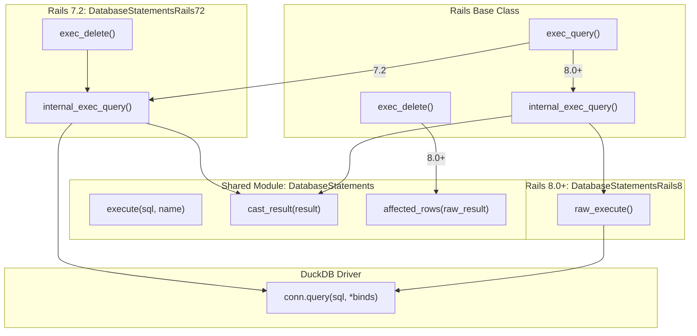
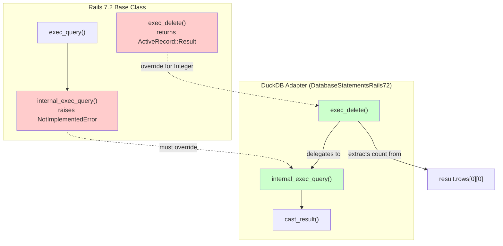
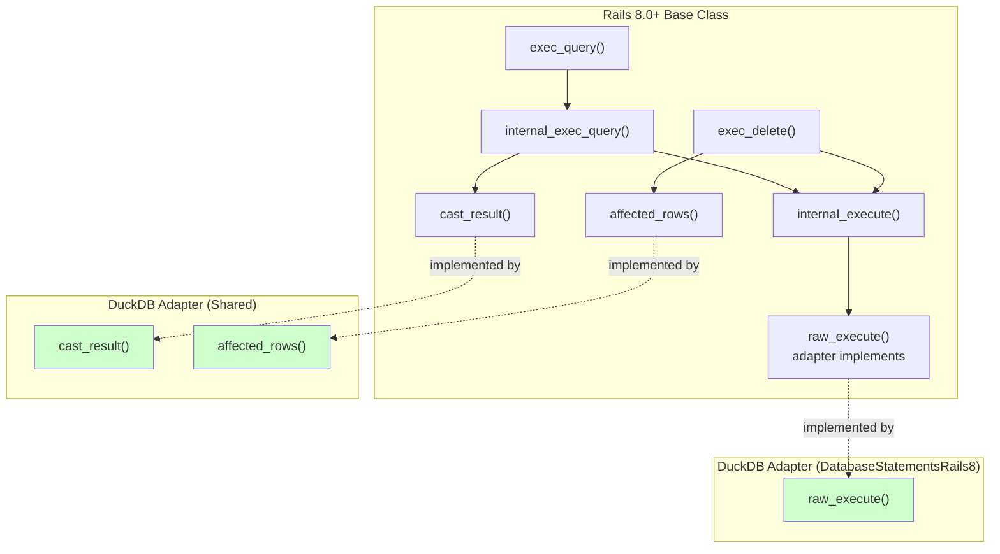
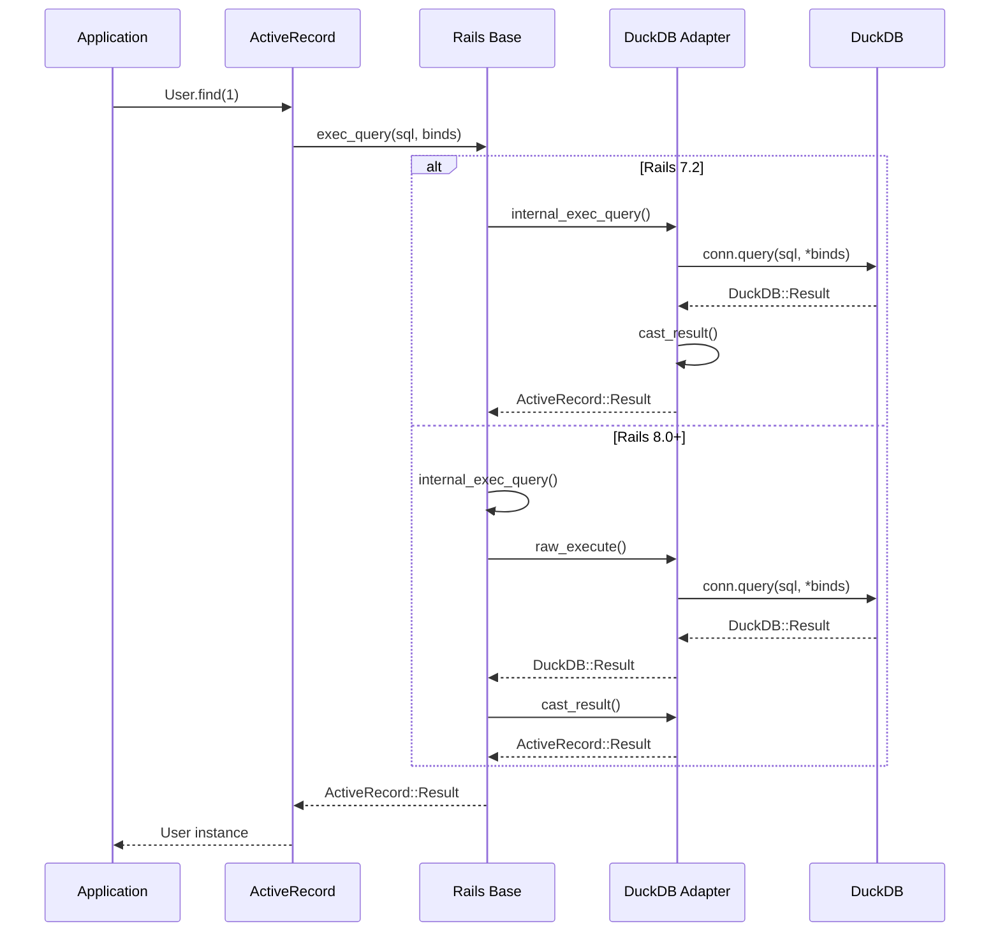
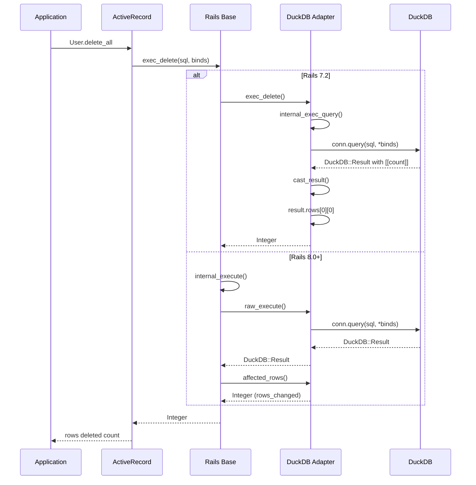
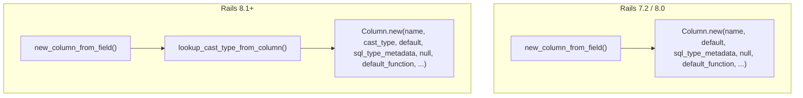

# Query Execution Call Graph

This document maps the query execution methods in the DuckDB adapter and how they interact across Rails versions.

## Overview

The DuckDB adapter uses **version-specific modules** to integrate with Rails' query execution infrastructure. This approach:
- Minimizes code duplication
- Uses Rails' native implementations where possible
- Maintains compatibility across Rails 7.2, 8.0, and 8.1

## Architecture



## Rails Version Differences

### Rails 7.2

In Rails 7.2, `internal_exec_query` in the base class raises `NotImplementedError`. Adapters **must** implement it.



**Required implementations in `DatabaseStatementsRails72`:**
- `internal_exec_query(sql, name, binds, prepare:, async:, allow_retry:)` → `ActiveRecord::Result`
- `exec_delete(sql, name, binds)` → `Integer` (delegates to `internal_exec_query`, extracts count)

### Rails 8.0 & 8.1

In Rails 8.0+, the base class provides working implementations of `internal_exec_query` and `exec_delete` that delegate to lower-level methods. Adapters implement `raw_execute`, `cast_result`, and `affected_rows`.



**Required implementations for Rails 8.0+:**
- `raw_execute(sql, name, binds, prepare:, async:, allow_retry:, materialize_transactions:, batch:)` → `DuckDB::Result`
- `cast_result(raw_result)` → `ActiveRecord::Result` (shared)
- `affected_rows(raw_result)` → `Integer` (shared)

## File Structure

```
lib/active_record/connection_adapters/duckdb/
├── database_statements.rb          # Shared: execute, cast_result, affected_rows
├── database_statements_rails72.rb  # Rails 7.2: internal_exec_query, exec_delete
└── database_statements_rails8.rb   # Rails 8.0+: raw_execute
```

**Conditional inclusion in `duckdb_adapter.rb`:**

```ruby
include Duckdb::DatabaseStatements

if ActiveRecord::VERSION::MAJOR >= 8
  require 'active_record/connection_adapters/duckdb/database_statements_rails8'
  include Duckdb::DatabaseStatementsRails8
else
  require 'active_record/connection_adapters/duckdb/database_statements_rails72'
  include Duckdb::DatabaseStatementsRails72
end
```

## Method Signatures

### Shared (all Rails versions)

```ruby
# Raw SQL execution - returns native DuckDB result
def execute(sql, name = nil)
  # → DuckDB::Result
end

# Convert DuckDB result to ActiveRecord result
def cast_result(result)
  # → ActiveRecord::Result
end

# Extract row count from raw result
def affected_rows(raw_result)
  # → Integer (raw_result.rows_changed)
end
```

### Rails 7.2 Specific

```ruby
# Query execution - required since base class raises NotImplementedError
def internal_exec_query(sql, name = 'SQL', binds = [],
                        prepare: false, async: false, allow_retry: false)
  # → ActiveRecord::Result (via cast_result)
end

# Delete/Update - extracts count from DuckDB's result set
def exec_delete(sql, name = nil, binds = [])
  result = internal_exec_query(sql, name, binds)
  result.rows.first&.first || 0  # DuckDB returns [[count]]
end
alias exec_update exec_delete
```

### Rails 8.0+ Specific

```ruby
# Raw execution - base class internal_exec_query delegates here
def raw_execute(sql, name = nil, binds = [],
                prepare: false, async: false, allow_retry: false,
                materialize_transactions: true, batch: false)
  casted_binds = type_casted_binds(binds)
  log(sql, name, binds, casted_binds, async: async) do
    with_raw_connection(allow_retry:, materialize_transactions:) do |conn|
      casted_binds.empty? ? conn.query(sql) : conn.query(sql, *casted_binds)
    end
  end
  # → DuckDB::Result (base class wraps with cast_result)
end
```

## Query Flow Examples

### SELECT Query



### DELETE Query



## Design Decisions

### 1. Version-Specific Modules Over Shadowing

**Before:** Single `internal_exec_query` that shadowed Rails 8's base implementation.

**After:** Separate modules for each Rails version:
- Rails 7.2: Implements `internal_exec_query` (required)
- Rails 8.0+: Implements `raw_execute` (lets base handle higher-level methods)

**Benefits:**
- Uses Rails' native query infrastructure for logging, retries, async
- Cleaner separation of concerns
- Easier to adapt to future Rails changes

### 2. DuckDB DELETE Returns Count in Result Set

DuckDB's DELETE/UPDATE statements return the affected row count as a result set:

```sql
DELETE FROM users WHERE id = 1;
-- Returns: columns=["Count"], rows=[[1]]
```

Also available via `result.rows_changed`.

**Rails 7.2:** Extract from `result.rows[0][0]` after `internal_exec_query`
**Rails 8.0+:** Use `affected_rows(result)` → `result.rows_changed`

### 3. Shared vs Version-Specific Methods

| Method | Location | Reason |
|--------|----------|--------|
| `execute` | Shared | Same across all versions |
| `cast_result` | Shared | Used by all query paths |
| `affected_rows` | Shared | Rails 8.0+ base class calls it |
| `internal_exec_query` | Rails 7.2 only | Base class provides in 8.0+ |
| `exec_delete` | Rails 7.2 only | Base class handles in 8.0+ |
| `raw_execute` | Rails 8.0+ only | New API in Rails 8 |

---

## Schema Statements

The `SchemaStatements` module also uses version-specific modules due to a breaking change in Rails 8.1's `Column` class constructor.

### Column Constructor Change (Rails 8.1)



### Schema File Structure

```
lib/active_record/connection_adapters/duckdb/
├── schema_statements.rb            # Shared: tables, indexes, create_table, etc.
├── schema_statements_rails80.rb    # Rails 7.2/8.0: new_column_from_field
└── schema_statements_rails81.rb    # Rails 8.1+: new_column_from_field (with cast_type)
```

### Module Inclusion

```ruby
# In duckdb_adapter.rb
if ActiveRecord::VERSION::MAJOR > 8 ||
   (ActiveRecord::VERSION::MAJOR == 8 && ActiveRecord::VERSION::MINOR >= 1)
  require 'active_record/connection_adapters/duckdb/schema_statements_rails81'
  include Duckdb::SchemaStatementsRails81
else
  require 'active_record/connection_adapters/duckdb/schema_statements_rails80'
  include Duckdb::SchemaStatementsRails80
end
```

### Schema Methods Overview

| Method | Location | Purpose |
|--------|----------|---------|
| `tables` | Shared | List all tables |
| `indexes` | Shared | List indexes for a table |
| `create_table` | Shared | Create table with sequence handling |
| `create_sequence` | Shared | Create DuckDB sequence |
| `type_to_sql` | Shared | Convert Rails types to DuckDB SQL |
| `new_column_from_field` | Version-specific | Create Column from DB metadata |
| `fetch_type_metadata` | Shared | Parse DuckDB type strings |
